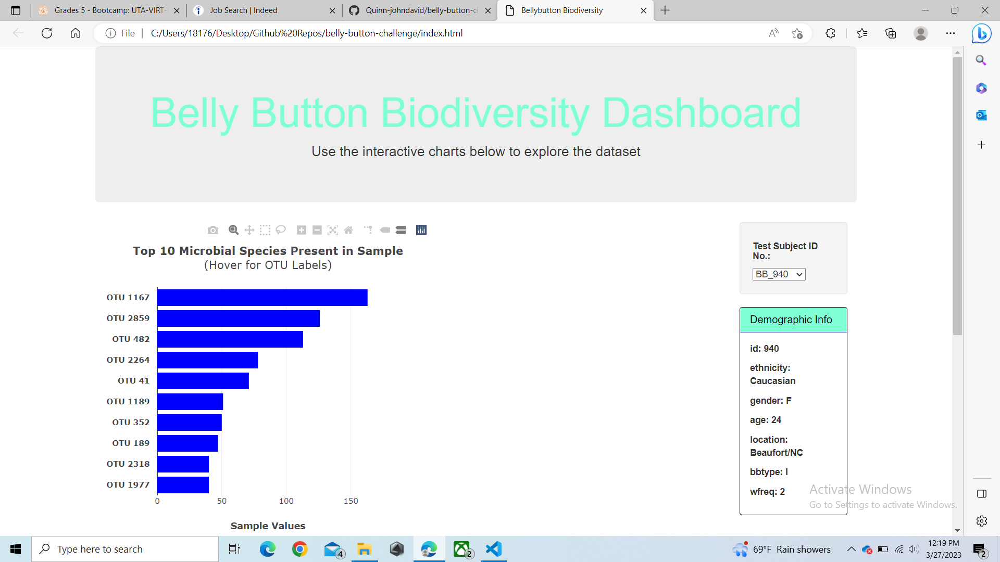

# belly-button-challenge

In this challenge we have visualized a dataset using D3 to pull the data in json format, and from there used javascript to visualize the dash. Html was also used to visualize the page and to futher customize the look of it. 

